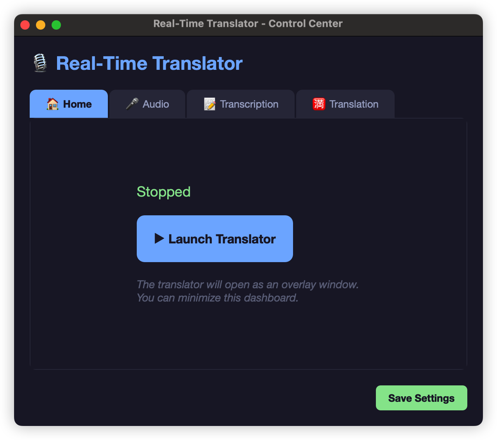
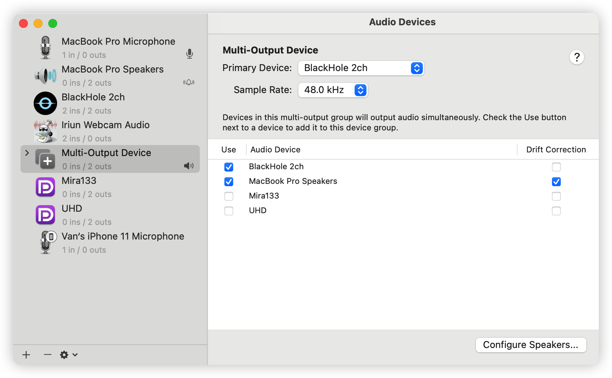
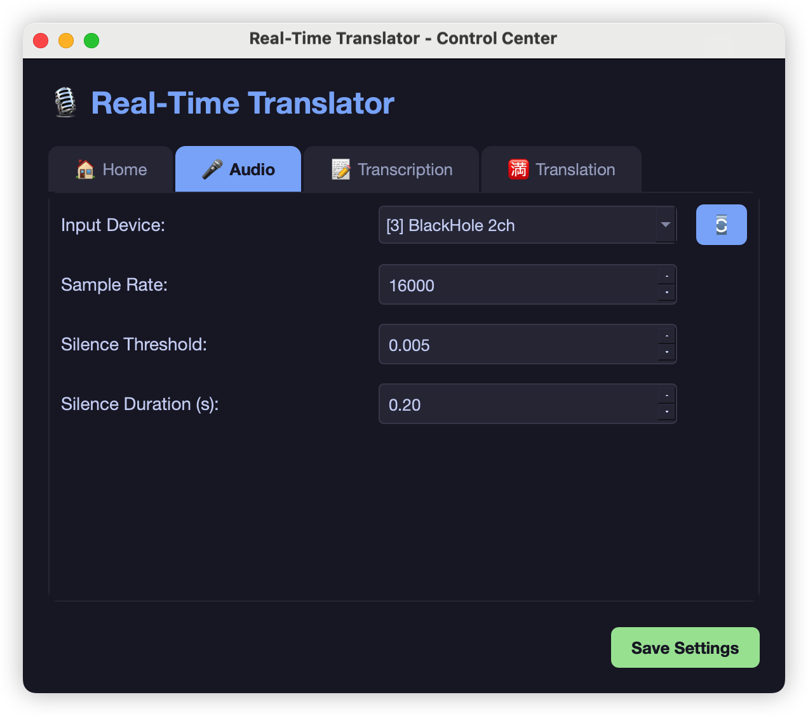

# Real-Time Translator 🎙️➡️🇨🇳

A high-performance real-time speech-to-text and translation application built for macOS (Apple Silicon optimized).

## Features
- **⚡️ Real-Time Transcription**: Instant streaming display using `faster-whisper`, `mlx-whisper`, or `FunASR`.
- **🎯 Multiple ASR Backends**: Choose between Whisper (multilingual), MLX (Apple Silicon optimized), or FunASR (industrial-grade Chinese/English).
- **🎤 Speaker Diarization**: Identify and label different speakers in real-time using diart (optional).
- **🌊 Word-by-Word Streaming**: See text appear as you speak, with smart context accumulation.
- **🔄 Async Translation**: Translates text to Chinese (or target language) in the background without blocking the UI.
- **🖥️ Overlay UI**: Always-on-top, transparent, click-through window for seamless usage during meetings/videos.
- **⚙️ Hot Reloading**: Change code or config and the app restarts automatically.
- **💾 Transcript Saving**: One-click save of your session history. Can be used as subtitle or LLM analyze.

## Demo
https://github.com/Vanyoo/realtime-subtitle/raw/refs/heads/master/demo/demo%20screenshot.mp4



## Installation

1. **Prerequisites**:
   - Python 3.10+
   - macOS (recommended for `mlx-whisper` support)
   - `ffmpeg` installed (e.g., `brew install ffmpeg`)
   - `BlackHole` installed (e.g., `brew install blackhole-2ch`, need to enter system password)
   - `BlackHole` Settings

2. **Install Dependencies**:
   ```bash
   pip install -r requirements.txt
   ```
   
   *(Ensure you have `PyQt6`, `sounddevice`, `numpy`, `openai`, `watchdog` installed)*

   **🪟 Windows Users**:
   1. Double-click `install_windows.bat` to automatically set up the environment.
   2. Ensure [FFmpeg](https://ffmpeg.org/download.html) is installed and added to your PATH.

   **🖥 MacOS Users**:
   1. Use terminal to run `install_mac.sh`

## ✨ New Features & Quick Start
- **Modern Control Center**: Manage all settings in a dark-themed Dashboard.
- **One-Click Launch**: Start the overlay translator directly from the Dashboard.
- **Auto-Dependency Check**: Automatically installs missing requirements.
- **Audio Device Selection**: Choose your specific microphone input.

## Usage

### 1. Start the Application
Run the helper script for your OS:
- **Mac/Linux**: `./start_mac.sh`
- **Windows**: `start_windows.bat`

### 2. The Dashboard
The application opens the **Real-Time Translator Control Center**.
- **Home**: Click **"▶ Launch Translator"** to start the overlay.
- **Audio**: Select your Input Device and adjust Silence Threshold.
  * <details>
     <summary>How to Set</summary>
     1. Audio MIDI Setup: create multiple devices, including `BlackHole 2ch` device, and if you want to listen too, remember adding system output device

     

     2. Choose target audio device to capture

     
   </details>
- **Transcription**: Choose Whisper model size (tiny, base, small, medium, large-v3, [see the difference](https://github.com/openai/whisper?tab=readme-ov-file#available-models-and-languages)).
  * <details>
     <summary>How to Set</summary>
     
     * MacOS
       * Whisper Model: base
       * Compute Device: audo
       * Quantization: float16
   </details>
- **Translation**: Set your OpenAI API Key and Target Language.
- **Save Settings**: Click "Save Settings" to persist your configuration.

### 3. The Overlay
Once launched, a transparent window appears:
- **Move**: Click and drag text to move.
- **Resize**: Drag the bottom-right handle (◢).
- **Stop**: Click **"⏹"** on the overlay or "Stop Translator" in the Dashboard.
- **Save**: Click **"💾 Save"** to export transcript.

## ⚙️ Configuration Reference
Settings are managed via the Dashboard, but stored in `config.ini`.

#### `[api]` Section
| Parameter | Description | Examples |
| :--- | :--- | :--- |
| `base_url` | API Endpoint | `https://api.openai.com/v1`, `http://localhost:11434/v1` |
| `api_key` | Auth Key | `sk-...` (or `dummy` for local) |
| `target_lang` | Output Language | `Chinese`, `English`, `Japanese` |

#### `[transcription]` Section
| Parameter | Description | Details |
| :--- | :--- | :--- |
| `backend` | ASR Engine | `whisper` (default), `mlx` (Apple Silicon), `funasr` (Alibaba) |
| `whisper_model` | Whisper Model Size | `tiny` (fast), `large-v3` (accurate) |
| `funasr_model` | FunASR Model Name | `paraformer-zh` (Chinese), `SenseVoiceSmall` (Multi-lang) |
| `device` | Compute Unit | `auto` (Apple Neural Engine), `cuda` (NVIDIA) |

#### `[audio]` Section
| Parameter | Description | Details |
| :--- | :--- | :--- |
| `silence_threshold`| Sensitivity | `0.005` (Quiet) to `0.05` (Loud) |
| `device_index` | Mic ID | `auto` or specific index `0`, `1`... |

#### `[diarization]` Section (NEW!)
| Parameter | Description | Details |
| :--- | :--- | :--- |
| `enable_diarization` | Enable speaker diarization | `true` or `false` (default: false) |
| `step` | Diarization step size | In seconds (default: 0.5) |
| `latency` | Maximum latency | In seconds (default: 0.5) |

## Troubleshooting
- **No Audio?** Check the terminal for "Audio Capture" logs. If using BlackHole, ensure it's selected in `config.ini` or auto-detected.
- **Resize not working?** Use the designated "◢" handle in the bottom-right.
- **Hot Reload**: Modify any `.py` file or save settings in the UI to trigger a reload.

## 🎯 Using FunASR (NEW!)

FunASR is Alibaba's industrial-grade ASR toolkit with excellent Chinese language support.

**Quick Start:**
1. Set backend to `funasr` in Settings or `config.ini`
2. Choose a FunASR model (e.g., `iic/speech_paraformer-large_asr_nat-zh-cn-16k-common-vocab8404-pytorch` for Chinese)
3. Models auto-download on first use from ModelScope

**Recommended Models:**
- **Chinese (Offline)**: `iic/speech_paraformer-large_asr_nat-zh-cn-16k-common-vocab8404-pytorch`
- **Chinese (Streaming)**: `iic/speech_paraformer_asr_nat-zh-cn-16k-common-vocab8404-online`
- **English (Streaming)**: `iic/speech_UniASR_asr_2pass-en-16k-common-vocab1080-tensorflow1-online`
- **Multi-language**: `iic/SenseVoiceSmall` or `FunAudioLLM/SenseVoiceSmall`
- **Latest 31-language model**: `FunAudioLLM/Fun-ASR-Nano-2512` (Supports dialects, accents, lyrics)

**Note**: FunASR model names must include the namespace (e.g., `iic/` or `FunAudioLLM/`)

## 🎤 Speaker Diarization (NEW!)

Speaker diarization allows the application to identify and label different speakers in real-time conversations, meetings, or multi-person audio.

**⚠️ Important: PyTorch Compatibility**

The `diart` library requires **PyTorch < 2.1.0** due to the removal of `AudioMetaData` in newer versions. If you have a newer PyTorch version, you'll need to downgrade:

```bash
# Check your PyTorch version
python -c "import torch; print(torch.__version__)"

# If version >= 2.1.0, downgrade:
pip install torch==2.0.1 torchaudio==2.0.2
pip install diart>=0.9.0
```

**Quick Start:**
1. Install compatible PyTorch and diart (see above)

2. Enable diarization in `config.ini`:
   ```ini
   [diarization]
   enable_diarization = true
   step = 0.5
   latency = 0.5
   ```

3. Start the application - speaker labels will appear above transcriptions

**Features:**
- **Real-time speaker identification**: Automatically detects and labels different speakers (Speaker 1, Speaker 2, etc.)
- **Async processing**: Diarization runs independently in background thread, never blocks transcription
- **Visual speaker labels**: Each transcription shows which speaker is talking with a 🎤 icon
- **Color feedback**: Speaker labels flash green when updated asynchronously
- **Transcript export**: Saved transcripts include speaker information
- **Low latency**: Optimized for real-time processing with configurable step size

**Architecture:**
```
Transcription → Display immediately → Queue for diarization
             ↓                      ↓
        Translation          Speaker identification
        (async)              (async, independent)
             ↓                      ↓
        Update UI            Update speaker label
```

**Configuration Options:**
- `enable_diarization`: Set to `true` to enable speaker diarization
- `step`: Step size in seconds for diarization updates (default: 0.5)
- `latency`: Maximum latency in seconds (default: 0.5)

**Note**: If diarization fails to initialize (PyTorch incompatibility), the app will continue to work normally without speaker labels.


## License: MIT
Copyright 2025 Van

Permission is hereby granted, free of charge, to any person obtaining a copy of this software and associated documentation files (the “Software”), to deal in the Software without restriction, including without limitation the rights to use, copy, modify, merge, publish, distribute, sublicense, and/or sell copies of the Software, and to permit persons to whom the Software is furnished to do so, subject to the following conditions:

The above copyright notice and this permission notice shall be included in all copies or substantial portions of the Software.

THE SOFTWARE IS PROVIDED “AS IS”, WITHOUT WARRANTY OF ANY KIND, EXPRESS OR IMPLIED, INCLUDING BUT NOT LIMITED TO THE WARRANTIES OF MERCHANTABILITY, FITNESS FOR A PARTICULAR PURPOSE AND NONINFRINGEMENT. IN NO EVENT SHALL THE AUTHORS OR COPYRIGHT HOLDERS BE LIABLE FOR ANY CLAIM, DAMAGES OR OTHER LIABILITY, WHETHER IN AN ACTION OF CONTRACT, TORT OR OTHERWISE, ARISING FROM, OUT OF OR IN CONNECTION WITH THE SOFTWARE OR THE USE OR OTHER DEALINGS IN THE SOFTWARE.
